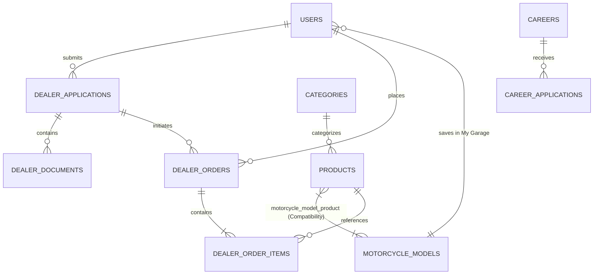

# R1 Moto Performance E-Commerce & B2B Dealer Portal

> **Full-Stack Capstone / On-the-Job Training (OJT) Project**  
> **Tech Stack:** React 18+ (Vite SPA) &bull; Laravel 11 REST API &bull; Laravel Sanctum &bull; MySQL

[](https://opensource.org/licenses/MIT)
[-blue.svg)](https://vitejs.dev/)
[](https://laravel.com/)
[](https://www.mysql.com/)

---

## 📌 Project Overview
**R1 Moto Performance** is a specialized high-performance motorcycle parts manufacturer and distributor focusing on Continuously Variable Transmission (CVT) tuning components, ceramic braking systems, and motorcycle fluids.

This web application serves two core audiences:
1. **Riders & Consumers (B2C):** Interactive product catalog featuring a **Two-Way Motorcycle Compatibility Engine** (find parts by motorcycle model, or inspect compatible motorcycle models per part).
2. **Wholesale Dealers & Distributors (B2B):** Streamlined dealer onboarding, verification document upload (DTI, permits, IDs), interactive wholesale bulk order sheet, automated **Purchase Order PDF generation**, and consolidated backend **ZIP archive download**.

---

## 🏗️ System Architecture

```
R1-Moto-Performance/
├── frontend/                     # React 18+ SPA (Vite, Tailwind, React Router v6)
│   ├── src/
│   │   ├── components/           # UI Components (Navbar, Footer, ProductCards, Modals)
│   │   ├── context/              # AuthContext (Login, Sign Up, Sanctum Token, RBAC)
│   │   ├── pages/                # Home, Catalog, Compatibility, Dealer, About, Admin
│   │   ├── services/             # Axios API Client & Endpoints
│   │   └── App.jsx
│   └── package.json
│
├── backend/                      # Laravel 11 REST API Engine
│   ├── app/
│   │   ├── Http/Controllers/    # Auth, Product, Compatibility, Dealer, Order
│   │   └── Models/               # User, Product, Category, MotorcycleModel, etc.
│   ├── database/
│   │   ├── migrations/           # 12+ Relational Table Migrations
│   │   └── seeders/              # Admin User, Categories, Specs, Bike Fitment Seeders
│   ├── routes/api.php            # RESTful API Endpoints
│   └── composer.json
│
├── PROJECT_PROPOSAL_AND_SPRINT_PLAN.md   # Complete OJT Project Specification & Roadmap
└── README.md
```

---

## 🗄️ Database Entity Relationship (ERD)



---

## 🚀 Sprint Progress (Sprint 0: Setup & Migrations)

- [x] **Sprint 0: Architecture Setup & Database Migrations** (Current)
  - [x] Repository initialized & `.gitignore` configured (internal assets excluded)
  - [x] Decoupled folder structure (`frontend/` and `backend/`)
  - [x] Complete database migrations schema (Users, Catalog, Compatibility Pivot, Dealer)
  - [x] Database seeders with authentic R1 Moto Performance product specifications
  - [x] React frontend foundation with dark/red motorsport styling and global routing
- [ ] **Sprint 1:** Authentication System (Login & Sign Up) & Product Catalog Showcase
- [ ] **Sprint 2:** Two-Way Motorcycle Compatibility Engine & My Garage
- [ ] **Sprint 3:** Brand Content (About Us, Locator, Careers & Contact)
- [ ] **Sprint 4:** B2B Dealer Portal & Wholesale Order Sheet
- [ ] **Sprint 5:** Automated PDF Order Generator & Consolidated ZIP Exporter
- [ ] **Sprint 6:** Admin CMS Dashboard, Security, Testing & Release v1.0.0

---

## 💻 Local Development Setup

### 1. Prerequisites
* **PHP 8.2+** and **Composer** (Available via [Laragon](https://laragon.org/) or [XAMPP](https://www.apachefriends.org/))
* **MySQL 8.0+**
* **Node.js 18+** and **npm**

### 2. Backend Setup (Laravel 11)
```bash
cd backend
composer install
cp .env.example .env
php artisan key:generate

# Configure your database in .env (DB_DATABASE=r1_moto_performance)
php artisan migrate --seed
php artisan serve
```
Backend API will be running on `http://localhost:8000`.

### 3. Frontend Setup (React Vite)
```bash
cd frontend
npm install
npm run dev
```
Frontend development server will be running on `http://localhost:5173`.

---

## 🔐 Default Seeded Accounts
| Role | Email | Password | Access Level |
| :--- | :--- | :--- | :--- |
| **Admin** | `admin@r1moto.com` | `password` | Full CMS, Order Review, PDF & ZIP Exports |
| **Dealer** | `dealer@r1moto.com` | `password` | Wholesale Portal, Bulk Ordering, Perks |
| **Customer** | `rider@r1moto.com` | `password` | Public Catalog, My Garage, Compatibility |
